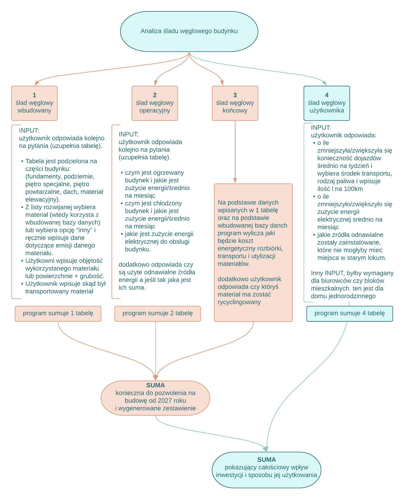

# *Building carbon footprint calculator*

*Have you ever wondered what the carbon footprint of the house you are about to build is? Is it more ecologically sound to build a wood and clay house 100km from your workplace or to live in a reinforced concrete building and walk to the office every day? Does it make more of an impact on the environment to build huge shopping malls or to have millions of couriers handling e-commerce every day? Is it more profitable to build a reinforced concrete bridge over a river or to leave a 20 km diversions for a thousand cars a day. While part of the office work can be relocated for ecological reasons and thus the construction of new office buildings can be limited, the construction of schools and hospitals is necessary for the development of local communities. One thing is certain: some buildings are necessary, while others are unnecessary and even harmful.*

*The construction sector is responsible for producing almost 40% of the world's greenhouse gases. This includes 11% during the construction and production of building materials (embedded carbon footprint) and over 28% during the use of the building (operational carbon footprint). It is therefore important for investors, architects and building users to be aware of the environmental impact of their building.*

*The operational carbon footprint is decreasing year on year, mainly due to the decreasing energy demand of buildings and the increasing importance of RES. Tougher legislation on building energy efficiency or certification also contributes to this. In contrast, the size of the embedded carbon footprint is increasing. This is due, among other things, to the fact that buildings are being fitted with increasingly sophisticated equipment and their production is quite carbon-intensive.*

*The carbon footprint is a concept that defines the total emissions of greenhouse gases that are produced directly and indirectly by a functional unit. These emissions are expressed through carbon dioxide equivalents. The carbon footprint is expressed as GWP (Global Warming Potential), which stands for Global Warming Potential and is measured in tonnes of carbon dioxide equivalent CO2eq.*

*From 2027 in Poland, it will be mandatory to provide a calculation of a building's carbon footprint when obtaining a building permit. This is only the beginning of an environmental transformation in the building industry and a new way of thinking about construction.*

## Kalkulator śledu węglowego budynku

Czy zastanawiałeś się kiedyś jaki jest ślad węglowy domu, którego masz zamiar wybudować? Czy ze względu na ekologię bardziej opłaca się wybudować domek z drewna i gliny oddalony o 100km od miejsca pracy czy jednak zamieszkać w żelbetowym budynku i chodzić codziennie na piechotę do biura. Czy większy wpływ na środowisko mają budowy wielkich galerii handlowych czy miliony kurierów obsługujący codziennie handel internetowy. Czy bardziej opłaca się wybudować żelbetowy most na rzece czy pozostawić objazd o długości 20km dla tysiąca aut dziennie. O ile część pracy biurowej ze względów ekologiczncych możena przenieść do miejsc zamieszkania i przez to ograniczyć budoowę nowych budynków biurowych to już budowa szkół i szpitali jest konieczna dla rozwoju społeczeństw lokalnych. Jedno jest pewne niektóre budowle są konieczne a inne zbędne i wręcz szkodliwe.

Sektor budownictwa jest odpowiedzialny za produkcję prawie 40% gazów cieplarnianych na świecie. W tym 11% podczas konstrukcji i produkcji materiałów budowlanych (ślad węglowy wbudowany) a ponad 28% podczas użytkowania budynku (ślad węglowy operacyjny). Dlatego tak ważne jest świadomość inwestorów, architektów i użytkowników budynków jaki wpływ ma ich budynek na środowisko.

Ślad węglowy operacyjny zmniejsza się z roku na rok, głównie za sprawą coraz mniejszego zapotrzebowania na energię budynków i zwiększającego się znaczenia OZE. Udział w tym mają również zaostrzone przepisy dotyczące efektywności energetycznej budynków czy ich certyfikacji. Z kolei wielkość śladu węglowego wbudowanego rośnie. Dzieje się m.in. ze względu na wyposażanie budynków są w coraz bardziej zaawansowane urządzenia, a ich produkcja jest dość emisyjna.

Ślad węglowy to pojęcie definiujące całkowitą emisję gazów cieplarnianych, które są wytwarzane pośrednio i bezpośrednio przez jednostkę funkcjonalną. Emisja ta wyrażana jest poprzez ekwiwalent dwutlenku węgla.
Ślad węglowy wyrażany jest jako GWP (z ang. Global Warming Potential), co oznacza potencjał tworzenia efektu cieplarnianego i mierzony w tonach ekwiwalentu dwutlenku węgla CO2eq.

Od roku 2027 w Polsce przy otrzymywaniu pozwolenia na budowę będzie obowiązek przedstawienie wyliczenia śladu węglowego budynku. To dopiero początek transformacji ekologicznej w budownictwie i nowym sposobie myślenia o budownictwie.
## Table of Contents | Spis Treści

  - [Carbon Footprint of buildings | Ślad węglowy budynku](#feasibility-analysis-of-site)
  - [Table of Contents | Spis Treści](#table-of-contents--spis-treści)
  - [General Information | Podstawowe Informacje](#general-information--podstawowe-informacje)
  - [Technologies Used | Użyte technologie](#technologies-used--użyte-technologie)
  - [Features | Funkcje](#features--funkcje)
  - [Usage | Sposób Użycia](#usage--sposób-użycia)
  - [Project Status | Status Projektu](#project-status--status-projektu)
  - [Room for Improvement | Planowane Aktualizacje](#room-for-improvement--planowane-aktualizacje)
  - [Contact | Kontakt](#contact--kontakt)
<!-- * [License](#license) -->

## General Information | Podstawowe Informacje

Analizę wykonujemy zgodnie z poniższym schematem. Program wykonuje swoje obliczenia na podstawie wbudowanej bazy danych zawierającej ślad węglowy początkowy poszczególnych materiałów.

Celem programu jest wygenerowanie sumy i zestawienia śladu węglowego budynku, wymaganą przez zapowiadane przepisy prawa budowlanego w 2027 roku. Dodatkowo program obliczy jak zmienił się ślad węglowy użytkownika dzięki powstaniu budynku.

## Technologies Used | Użyte technologie

- Python - version 3.11.2

## Features | Funkcje

List the ready features here:

## Usage | Sposób Użycia

zrzuty z ekranu
## Project Status | Status Projektu

IN PROGRESS!!!

## Room for Improvement | Planowane Aktualizacje

aktualnie program oblicza ślad węglowy domów jednorodzinnych, w przyszłości może być rozwiniety tak aby uwzględniał wszelkie typy budowli

## Contact | Kontakt

Created by [@AldonaKret] - feel free to contact me!

